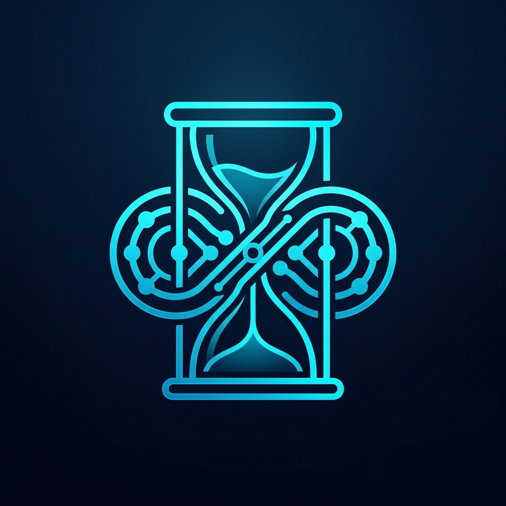

<p align="center">
  
</p>

# ⏳ Chronos-Link
### *Autonomous Architecture Documentation Agent*

**Chronos-Link** is an AI-powered agent designed to automate the creation of **Architecture Decision Records (ADRs)**. It doesn't just guess; it "probes" your project to understand your technology stack, scans your Git history to find the rationale for recent changes, and checks against your project's "Architectural Constitution" to ensure every decision is sound.

---

## ❓ What is an ADR?
Imagine you join a project and find a strange piece of code that limits the system to only 10 concurrent connections. You think, *"That's inefficient!"* and change it to 1,000. Suddenly, the database crashes. 

You just hit a **Hidden Decision**.

An **Architecture Decision Record (ADR)** is the cure for this. It is a short, version-controlled document that captures:
1.  **The Context**: What was happening at the time? (e.g., "Our database only supports 10 connections.")
2.  **The Decision**: What did we choose to do? (e.g., "Limit the app to 10 connections.")
3.  **The Rationale**: Why was this the best choice? (e.g., "To prevent database connection exhaustion.")
4.  **The Consequences**: What do we have to live with now? (e.g., "Slower throughput, but higher stability.")

### 💡 Why does it matter for Software Engineers?

*   **No More "Architecture Mysteries"**: When you encounter a weird design pattern, you don't have to hunt down the person who wrote it 3 years ago (who probably left the company). You just read the ADR.
*   **Context over Code**: Code tells you *what* the system does. ADRs tell you *why* the system is the way it is.
*   **Preventing Regression**: It stops teams from accidentally "re-deciding" things that were already proven to be bad ideas in the past.
*   **Scalable Brains**: As teams grow from 5 to 50 people, ADRs ensure everyone is aligned on the "Golden Rules" of the project without needing endless meetings.

---

## ✨ Why Chronos-Link?
Documenting architectural decisions is often tedious and forgotten. Chronos-Link acts as a Senior Architect peer that:
- 🔍 **Perceives**: Automatically detects if you are using Go, Python, Terraform, Docker, etc.
- 🕒 **Remembers**: Connects your recent code changes (Git diffs) to architectural logic.
- 🤖 **Reflects**: Uses an **Actor-Critic** loop to self-correct drafts before showing them to you.
- 🎨 **Visualizes**: Automatically generates Mermaid.js diagrams for complex decisions.

---

## 🚀 Getting Started

### 1. Prerequisites
Ensure you have [uv](https://github.com/astral-sh/uv) installed.

### 2. Installation
```bash
git clone https://github.com/azhry/chronos-link.git
cd chronos-link
uv sync --all-extras
```

### 3. Setup Environment
Create a `.env` file from the example:
```bash
cp .env.example .env
```
Open `.env` and configure your preferred provider:
- **Google Gemini**: Add `GEMINI_API_KEY` (Default).
- **Ollama**: Set `LLM_PROVIDER=ollama` (For local runs).
- **Anthropic**: Set `LLM_PROVIDER=anthropic` and add `ANTHROPIC_API_KEY`.

---

## 💻 Usage

### Basic Generation
Generate an ADR for the project in the current directory:
```bash
uv run chronos-link
```

### Target a Specific Project
To analyze a different project folder, use the `--workspace` (or `-w`) flag:
```bash
uv run chronos-link --workspace /path/to/your/project
```

### Switch Models on the Fly
You can override your `.env` settings directly from the CLI:
```bash
# Use local Llama 3 via Ollama
uv run chronos-link --provider ollama --model llama3.1

# Use Claude 3.5 Sonnet
uv run chronos-link --provider anthropic --model claude-3-5-sonnet-20240620
```

---

## 🛠️ Configuration Window (K-Window)
Chronos-Link uses a "Rolling Context Window" (Mei et al., 2025). By default, it reads the last **5 ADRs** to ensure new decisions are consistent with the past. You can change this in your `.env`:
```ini
K_WINDOW=10
```

---

## 📜 License
MIT License. Created with ❤️ for architects who hate writing docs.
